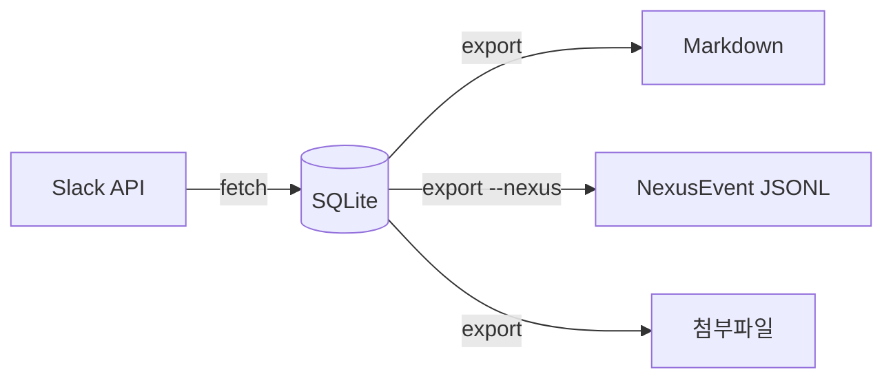

# 아키텍처

## 데이터 흐름



- **SQLite**: 단일 진실 공급원. 메시지/사용자/채널/파일 메타 저장, 증분 수집 상태 관리.
- **Markdown**: SQLite 파생물. QMD 인덱싱 + 사람 열람용. 언제든 재생성 가능.
- **NexusEvent JSONL**: `NEXUS_OUTBOX_DIR` 설정 시 work-nexus/data/outbox/ 출력.
- **단방향 흐름**: `fetch` → DB → `export` → 파일 시스템

## 멱등성

| 엔티티 | PK | 방식 |
|--------|-----|------|
| 메시지 | `(channel_id, ts)` | INSERT OR REPLACE |
| 사용자 | `id` | INSERT OR REPLACE |
| 파일 | `id` | INSERT OR REPLACE, `downloaded` 플래그 |
| 채널 증분 | `channels.latest_ts` | `oldest` 파라미터로 중복 수집 방지 |

## 채널 이름 변경 추적

채널 이름이 변경되면 `channels.former_name`에 구 이름 보존.
`fetch -c <구이름>` 실행 시 자동으로 현재 이름으로 매핑.

## 프로젝트 구조

```
src/slack_harvest/
  cli.py              # Click CLI
  config.py           # 설정 (keyring → env_var → 기본값)
  db/
    schema.py         # SQLite 스키마
    repository.py     # CRUD
  slack/
    client.py         # Slack API (httpx)
    models.py         # 데이터 모델
    rate_limiter.py   # Rate limit / 재시도
  export/
    markdown.py       # MD 변환
    linker.py         # 상대경로 링크
    mermaid.py        # Mermaid 변환
    downloader.py     # 파일 다운로드
    nexus.py          # NexusEvent JSONL
```
